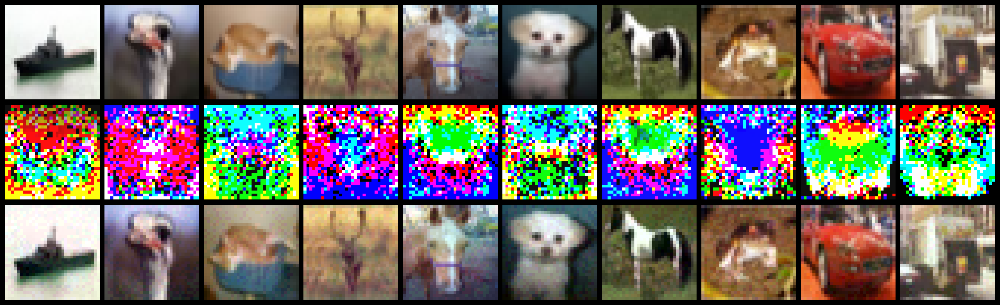

# Perturbation-Induced Linearization: Constructing Unlearnable Data with Solely Linear Classifiers

This repository is the official PyTorch implementation of the paper:
**Perturbation-Induced Linearization: Constructing Unlearnable Data with Solely Linear Classifiers**

Our work has been accepted by ICLR 2026. For more details, please refer to the OpenReview link: https://openreview.net/forum?id=GBSGToE97J


**Samples from PIL constructed CIFAR-10 unlearnable datasets.** We visualize clean images, normalized perturbations and perturbed images (top to bottom).

---

## Requirements

To install dependencies:

```bash
pip install -r requirements.txt
```

> Datasets such as CIFAR-10, CIFAR-100, and SVHN will be automatically downloaded when you run the code.

---

## Training

To generate the PIL-based unlearnable dataset **and train a victim model on it**, use:

```bash
python main.py \
  --dataset cifar10 \
  --attacked_model resnet18 \
  --pretrain_iter 30 \
  --lr_train 0.003 \
  --attack_iter 30 \
  --eps 0.0314 \
  --alpha 0.00314 \
  --lmd 0.9 \
  --lr_test 0.1 \
  --test_iter 30 \
```

**Explanation of key arguments:**

* `--dataset`: Choose from `svhn`, `cifar10`, `cifar100`
* `--pretrain_iter`, `--lr_train`: Pretraining settings for the linear classifier
* `--attack_iter`, `--eps`, `--alpha`, `--lmd`: Perturbation hyperparameters
* `--attacked_model`: Victim model to attack: `resnet18`, `resnet50`, `vgg19`, `densenet121`, `mobilenetv2`
* `--lr_test`, `--test_iter`: Training settings for the victim model
* `--show_clean_test`: Optionally train the same model on clean data for comparison
* `--save_path`: Directory to save perturbed datasets (default: `./data/ue`)

> 📌 **On a single GPU**, generating PIL-based perturbations for the entire CIFAR-10 training set (50,000 images) takes only **\~1 minute**.

---

## Evaluation

To evaluate model robustness on a pre-generated unlearnable dataset:

```bash
python evaluate.py \
  --dataset cifar10 \
  --unlearnable_path ./data/ue/unlearnable_cifar10.pt \
  --model resnet18 \
  --augmentation basic \
  --lr 0.1 \
  --iter 100
```

**Additional options:**

* `--augmentation`: Choose from `none`, `basic`, `rotation`, `perspective`, `grayscale`, `channelshuffle`, `cutout`, `cutmix`, `mixup`
* `--partial_perturb`, `--perturb_ratio`: Mix clean and perturbed data, e.g., `--perturb_ratio 0.3`
* `--AT`, `--AT_eps`: Enable PGD-7 adversarial training

---

## Unlearnable dataset

 **PIL perturbations can be generated very efficiently**. For example, you can generate CIFAR-10 unlearnable dataset in 2 minutes using:

```bash
python main.py --dataset cifar10
```

This will save the perturbed dataset to:

```bash
./data/ue/unlearnable_cifar10.pt
```

---

## Results

The following table shows test accuracy (%) on clean test sets, comparing clean training vs. PIL-generated unlearnable training:

| Model        | SVHN (Clean / PIL) | CIFAR-10 (Clean / PIL) | CIFAR-100 (Clean / PIL) | ImageNet Subset (Clean / PIL) |
| ------------ | ------------------ | ---------------------- | ----------------------- | ----------------------------- |
| ResNet-18    | 95.64 / **15.94**  | 92.11 / **12.77**      | 72.70 / **2.11**        | 66.00 / **2.26**              |
| ResNet-50    | 95.30 / **18.19**  | 89.54 / **20.32**      | 65.90 / **1.18**        | 71.20 / **2.26**              |
| VGG-19       | 95.22 / **9.12**   | 90.61 / **15.22**      | 64.57 / **1.40**        | 36.04 / **1.36**              |
| DenseNet-121 | 95.88 / **11.57**  | 93.51 / **17.70**      | 75.22 / **1.23**        | 76.98 / **3.14**              |
| MobileNet-V2 | 95.95 / **28.48**  | 91.94 / **14.05**      | 70.66 / **0.99**        | 71.26 / **2.20**              |
